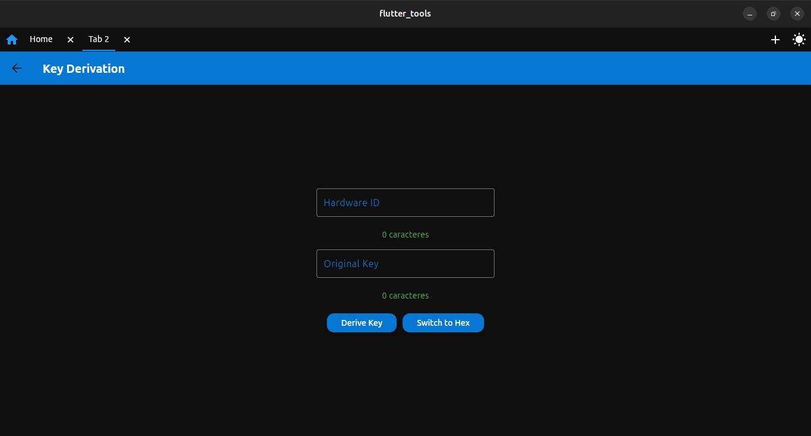

# Flutter Environment Setup

<!-- Badges -->


 

---

## Description

This document explains how to set up the Flutter environment and build the Flutter application for Windows.

---

## Table of Contents

* [Flutter Environment Setup](#flutter-environment-setup)
* [Building the Application](#building-the-application)
* [Screenshots](#screenshots)

---

## Flutter Environment Setup

### Requirements

* Ensure the Flutter SDK is installed and properly configured.
* Follow the instructions in the [Flutter Documentation](https://docs.flutter.dev/get-started/install/windows/desktop).

### Flutter Dependencies

Run the following command to fetch dependencies:

```bash
flutter pub get
```

---

## Building the Application

### Creating the Flutter Project with Windows Support

```bash
flutter create --platforms=windows flutter_tools
```

This command creates a Flutter project named `flutter_tools` with Windows support.

### Navigating to the Project Directory

```bash
cd flutter_tools
```

### Verifying the Environment

```bash
flutter doctor
```

This ensures all necessary tools are ready for Windows development.

### Running the Application on Windows

```bash
flutter run -d windows
```

The `-d windows` flag ensures the app runs in a Windows desktop environment.

### Building for Windows

```bash
flutter build windows
```

This generates the build files for distributing the application on Windows.

---

## Screenshots

<p align="center">
  
</p>
<p>Image 1: Main screen of the app.</p>

<p align="center">
  
</p>
<p>Image 2: Serial communication screen.</p>

<p align="center">
  
</p>
<p>Image 3: Key derivation screen.</p>

<p align="center">
  
</p>
<p>Image 4: Main screen in light mode with tab system.</p>

---

<!-- Personal Notes -->

> Keep the README updated with badges, version, and project status.

